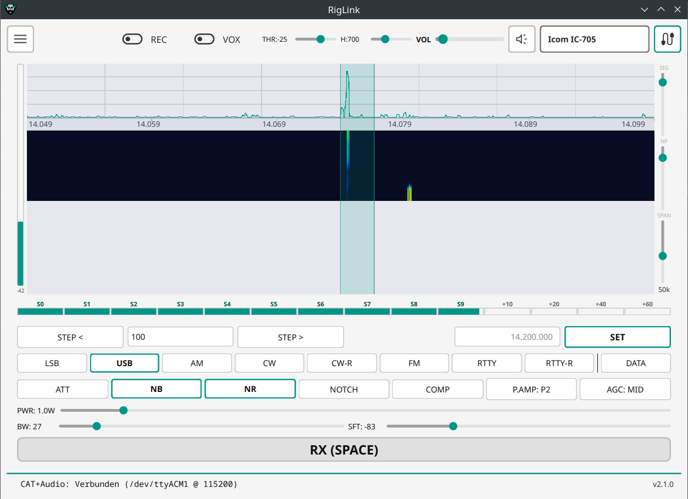
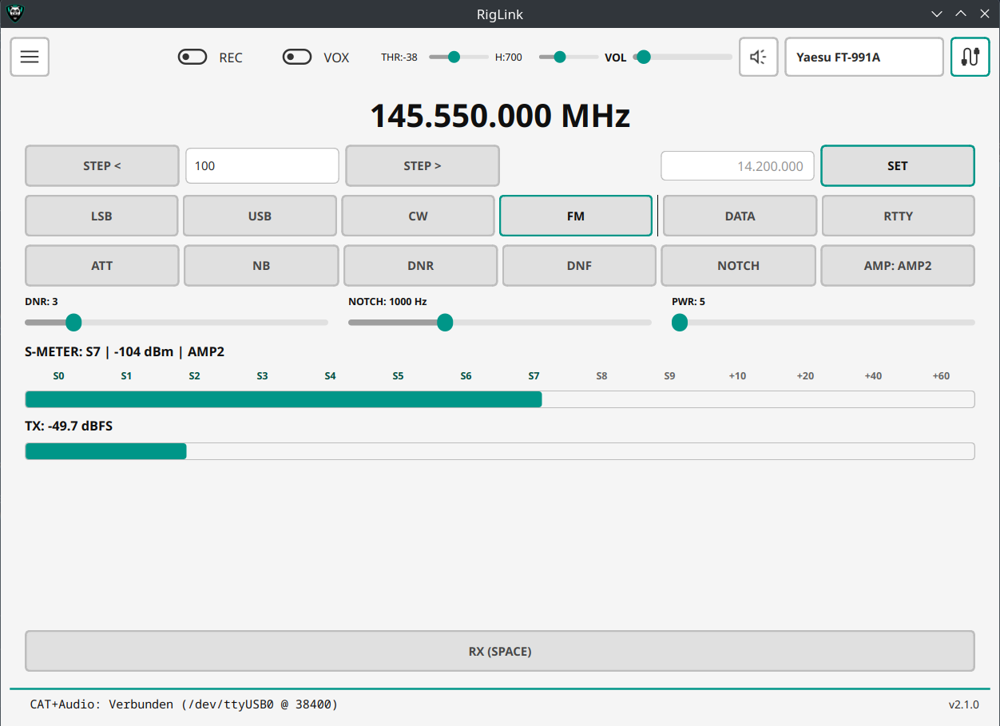
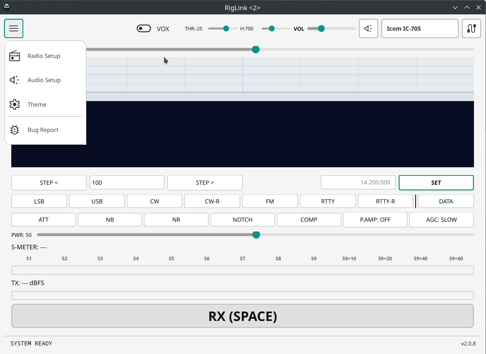
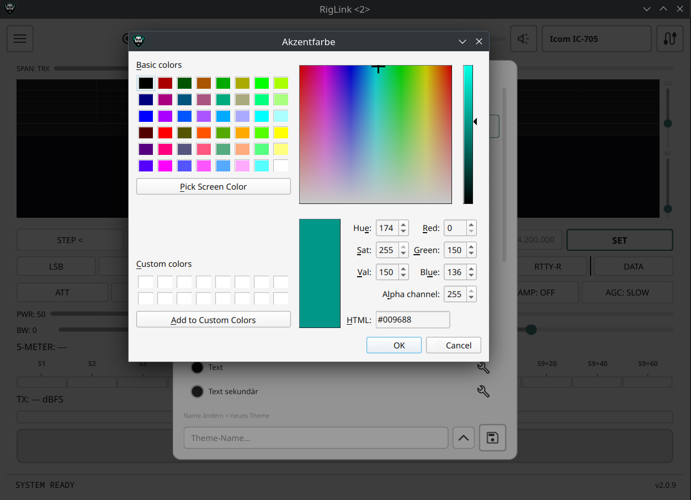
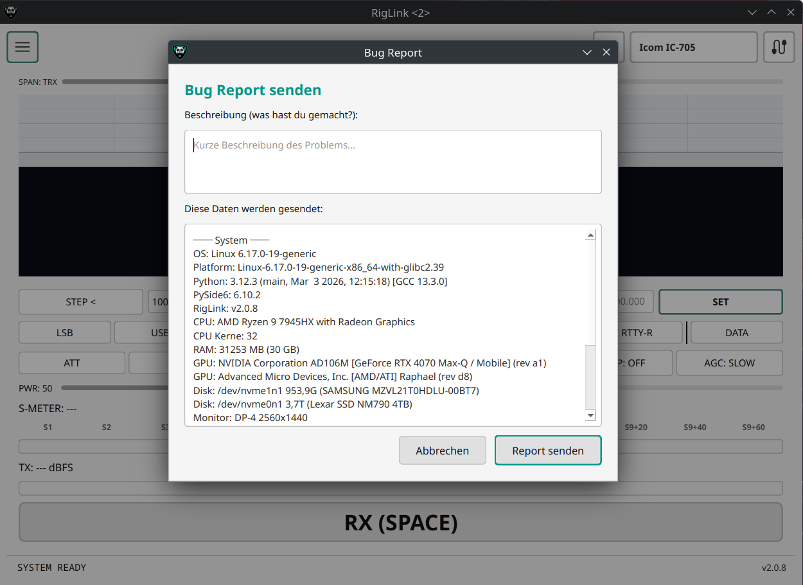

# RigLink — CAT Voice Control Interface

**RigLink** ist ein **CAT Voice Control Interface** für Funkgeräte — unterstützt **Yaesu, Icom, Kenwood** und **Elecraft**.

Ziel: Über **CAT** und die **eingebaute Soundkarte / USB-FT8-Schnittstelle** dein TRX steuern und darüber funken – **ohne** zusätzliche Adapter-Hardware. So kannst du direkt über die FT8/USB-Audio-Schnittstelle senden/empfangen und gleichzeitig per CAT (Frequenz/Mode/PTT) steuern.

**Getestet mit:** Yaesu FT-991A, Icom IC-705 (inkl. Wasserfall/Spektrum)

> **V2** ist ein kompletter Rewrite von CustomTkinter → **PySide6/Qt** mit neuem Theme-System und modularer Rig-Architektur.
> Die alte V1 (CustomTkinter + Windows .exe) findest du unter [Releases → v1.0-customtkinter](https://github.com/DO4NRW/RigLink/releases/tag/v1.0-customtkinter).

---

## Warum?

Viele TRX (z.B. FT-991A, IC-705, IC-7300, TS-890S) liefern über USB:

- **CAT** (Frequenz/Mode/PTT-Steuerung)
- **Audio In/Out** (wie bei FT8/WSJT-X)

Damit lässt sich Sprachbetrieb und Digitalbetrieb ohne extra Interface realisieren. Dieses Tool bündelt die Steuerung und das Audio-Handling in einer Oberfläche.

---

## Features

### CAT Control
- **Globaler CAT-Handler:** Yaesu, Icom CI-V, Kenwood/Elecraft Protokolle
- **24 Rigs** von 4 Herstellern vorkonfiguriert
- Frequenzanzeige 14.200.000 MHz + Tuning (Step Up/Down, direkte Eingabe)
- Mode-Umschaltung (LSB, USB, CW, CW-R, FM, RTTY, RTTY-R + DATA)
- DSP-Tools: ATT, NB, NR, NOTCH, COMP, AGC (rig-spezifisch)
- Preamp-Umschaltung
- Power-Regler
- S-Meter mit Kalibrierung aus Config

### Wasserfall / Spektrum (Icom)
- Echtzeit Spektrum + fließender Wasserfall via CI-V Scope
- **Click-to-Tune:** Klick im Wasserfall/Spektrum setzt Frequenz
- **Mausrad-Tuning:** Frequenz hoch/runter um Step-Size
- **Hover-Cursor:** Frequenz-Label am Mauszeiger
- Frequenz-Leiste mit Labels
- Center-Marker + Passband-Anzeige (USB/LSB/FM)
- Span-Slider (2.5 kHz - 500 kHz)
- Smooth Blend zwischen Sweeps
- Alle Farben aus Theme-System

### Bug Report System
- **Crash-Erkennung:** Automatischer Dialog beim Start nach Absturz
- **Session-Log:** Trackt alle User-Aktionen (Buttons, Connects, Fehler)
- **Report-Server:** Eigener Server (`raport.pcore.de`), kein Token im Code
- **HMAC-Signatur:** Spam-Schutz, nur echte RigLink-Reports
- **Hardware-Info:** CPU, RAM, GPU, Disks, Monitore, USB-Geräte
- **Datenschutz:** Vollständige Vorschau vor dem Senden

### PTT
- Methoden: CAT, RTS, DTR, VOX
- VOX mit Threshold, Hold, Debounce + Lockout
- Leertaste = PTT (alle Widgets auf NoFocus)

### Audio Routing
- **Linux:** PipeWire mit `pw-cat` + `--target node.name`
- **Windows/Mac:** sounddevice (WASAPI/CoreAudio)
- 4-Kanal Audio Matrix: PC Mic → TRX, TRX → PC Speaker
- RX Volume + Mute
- Wave Test + Aufnahme Test mit VU-Meter

### Theme-System
- **6 Builtin-Presets:** Dunkel (Standard), Hell, Blurple Night, Nord, Dracula, Monokai
- **User-Themes:** eigene Themes speichern, laden, löschen
- **RGBA Farbformat** für Transparenz-Support
- **Live-Apply** — Theme-Wechsel ohne Neustart
- Dynamische SVG Icons (hell/dunkel je nach Theme)
- Theme wird beim Beenden gemerkt

### Modulare Rig-Architektur
- Jeder TRX hat eigenen Ordner: `rig/<hersteller>/<modell>/`
- `config.json` + `<modell>_ui.py` pro Rig
- Globaler CAT-Handler in `core/cat/` (Yaesu, Icom, Kenwood)
- Hersteller/Modell Dropdowns in Radio Settings
- Rig-Widget wird dynamisch geladen
- Neues Rig = Ordner + config.json anlegen, App scannt automatisch

### Unterstützte Rigs

**Getestet:**
| Hersteller | Modelle |
|---|---|
| Yaesu | FT-991A |
| Icom | IC-705 |

**Experimentell (ungetestet):**
| Hersteller | Modelle |
|---|---|
| Yaesu | FT-891, FT-710, FT-DX101D/MP, FT-DX10, FT-950, FT-2000, FT-450, FT-857, FT-818 |
| Icom | IC-7300, IC-7610, IC-9700, IC-7100 |
| Kenwood | TS-890S, TS-2000, TS-590SG, TS-480 |
| Elecraft | K3, K3S, KX2, KX3 |

---

## Screenshots



<details>
<summary><b>Mehr Screenshots anzeigen</b></summary>

| | |
|---|---|
|  |  |
| **Main GUI** (FT-991A, Light Theme) | **Light Theme** mit Menü |
|  |  |
| **Radio Setup** (CAT + PTT) | **Audio Matrix** |
|  |  |
| **Theme Editor** | **Color Picker** |
|  | |
| **Bug Report** (Hardware-Info) | |

</details>

---

## Installation

### Linux (empfohlen)
```bash
# Fertige Binary (kein Python nötig):
# → Download unter Releases: RigLink_Linux.zip

# Oder aus Source:
git clone https://github.com/DO4NRW/RigLink.git
cd RigLink
python3 -m venv venv
source venv/bin/activate
pip install PySide6 numpy sounddevice pyserial
python main.py
```

### Windows / macOS
```bash
git clone https://github.com/DO4NRW/RigLink.git
cd RigLink
pip install PySide6 numpy sounddevice pyserial
python main.py
```

---

## Voraussetzungen

| Komponente | Linux | Windows | macOS |
|---|---|---|---|
| Python | 3.10+ | 3.10+ | 3.10+ |
| Audio | PipeWire | WASAPI | CoreAudio |
| CAT | pyserial | pyserial | pyserial |
| GUI | PySide6 | PySide6 | PySide6 |

---

## Projektstruktur

```
main.py                          — App-Start
main_ui.py                       — MainWindow, Overlays, Top-Bar
core/
  theme.py                       — Zentrales Theme-Modul (Mittelsmann)
  status.py                      — StatusManager
configs/
  theme.json                     — Aktuelle Farbkonfiguration (RGBA)
  status_conf.json               — Status-Messages, last_rig, last_theme
  user_themes.json               — Gespeicherte User-Themes
core/
  cat/                           — Globaler CAT-Handler
    __init__.py                  — CatBase + Factory
    yaesu.py                     — Yaesu CAT Protokoll
    icom.py                      — Icom CI-V Protokoll
    kenwood.py                   — Kenwood/Elecraft Protokoll
  waterfall.py                   — Wasserfall/Spektrum Widget
  rig_widget.py                  — Generisches Rig-Widget
rig/
  yaesu/ft991a/                  — FT-991A (CAT + Audio + UI)
  icom/ic705/                    — IC-705 (CAT + Wasserfall + UI)
  ...                            — 24 Rigs total
assets/
  icons/                         — SVG/PNG Icons (helles Set)
  icons/light/                   — SVG Icons (dunkles Set für helle Themes)
  audio/                         — Test-WAV
```

---

## Built with AI

Dieses Projekt wurde vollständig mit **Claude Code** (Anthropic) entwickelt — von der Architektur bis zum letzten Stylesheet.

## Lizenz

Open Source — 73 de DO4NRW
