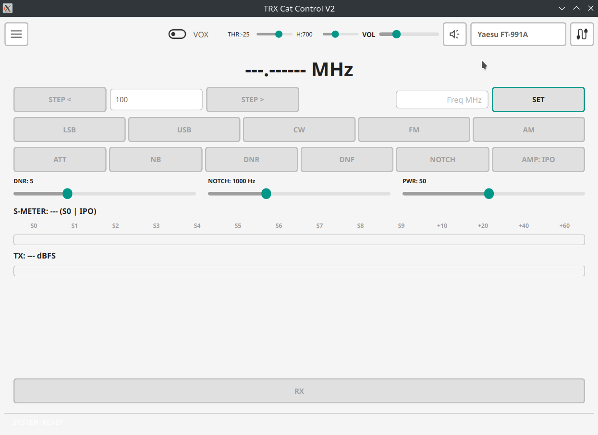
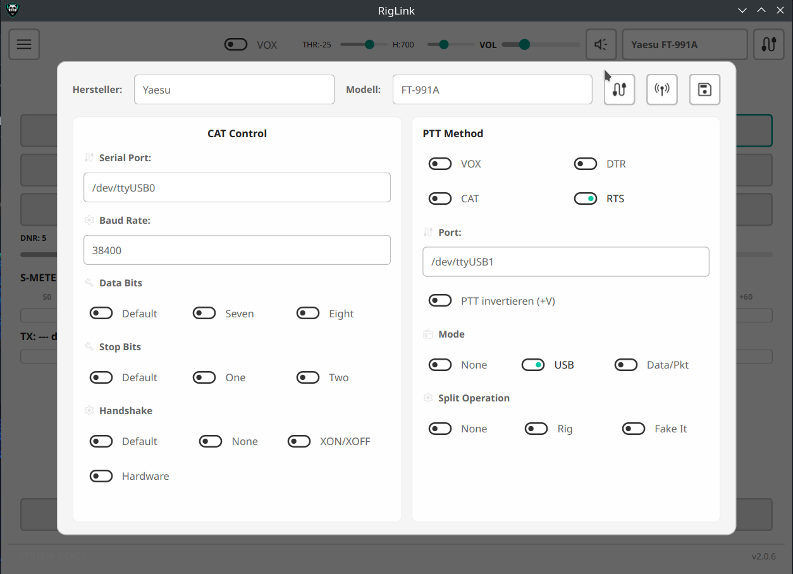
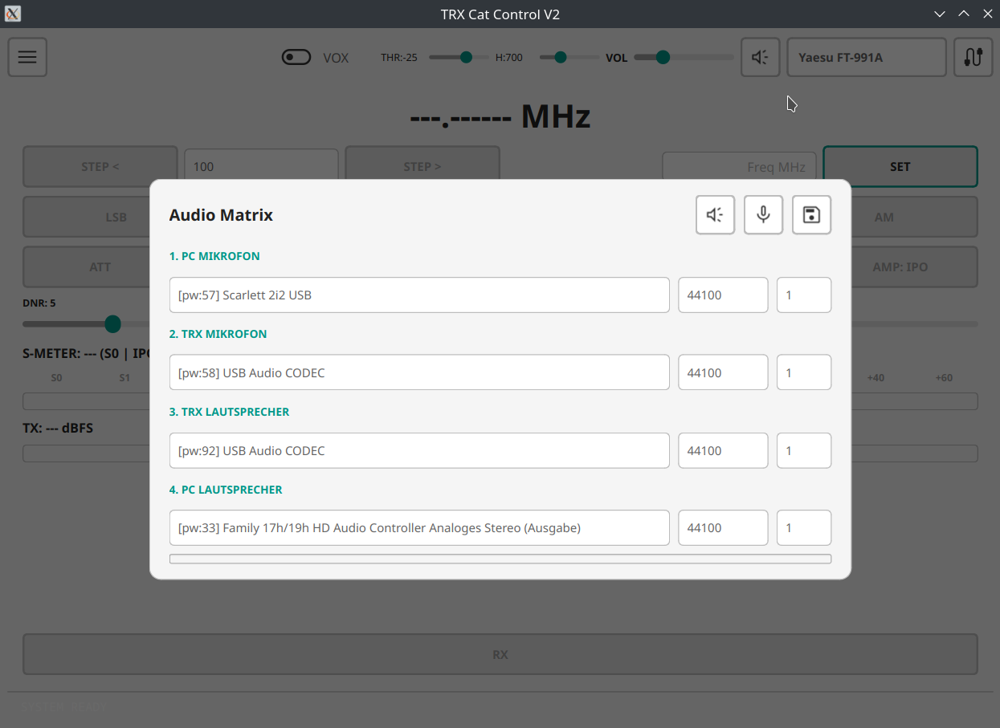
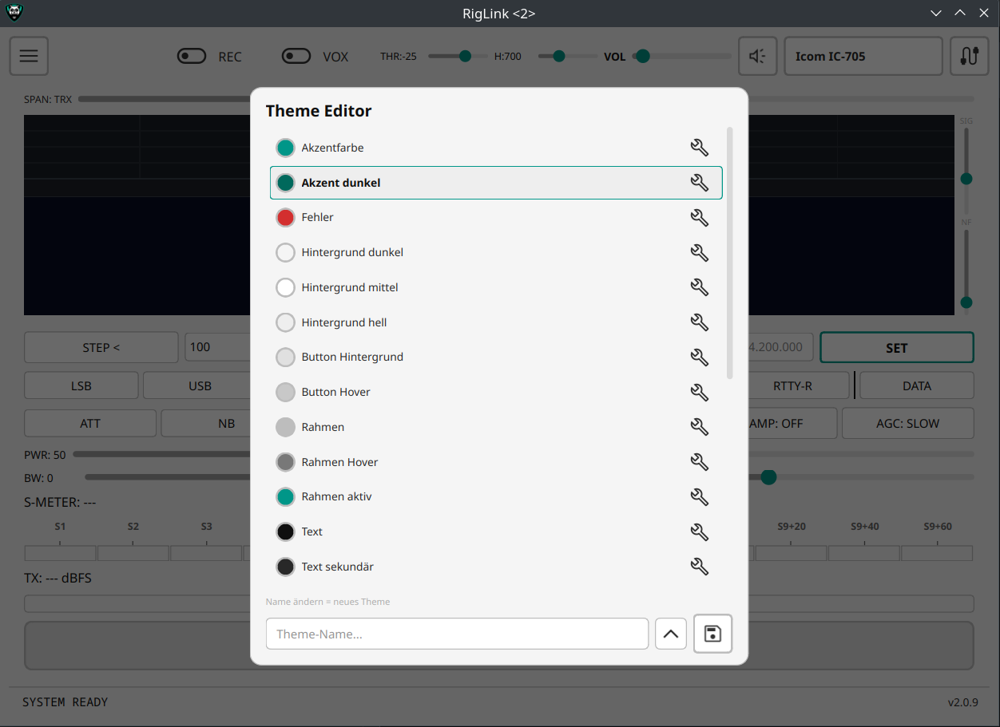

# RigLink — CAT Voice Control Interface

**RigLink** ist ein **CAT Voice Control Interface** für Funkgeräte (aktueller Fokus: **Yaesu FT-991A**).

Ziel: Über **CAT** und die **eingebaute Soundkarte / USB-FT8-Schnittstelle** dein TRX steuern und darüber funken – **ohne** zusätzliche Adapter-Hardware. So kannst du direkt über die FT8/USB-Audio-Schnittstelle senden/empfangen und gleichzeitig per CAT (Frequenz/Mode/PTT) steuern.

> **V2** ist ein kompletter Rewrite von CustomTkinter → **PySide6/Qt** mit neuem Theme-System und modularer Rig-Architektur.
> Die alte V1 (CustomTkinter + Windows .exe) findest du unter [Releases → v1.0-customtkinter](https://github.com/DO4NRW/TRX-Cat-Controll/releases/tag/v1.0-customtkinter).

---

## Warum?

Viele TRX (z.B. FT-991A) liefern über USB:

- **CAT** (Frequenz/Mode/PTT-Steuerung)
- **Audio In/Out** (wie bei FT8/WSJT-X)

Damit lässt sich Sprachbetrieb und Digitalbetrieb ohne extra Interface realisieren. Dieses Tool bündelt die Steuerung und das Audio-Handling in einer Oberfläche.

---

## Features

### CAT Control
- Frequenzanzeige + Tuning (Step Up/Down, direkte Eingabe)
- Mode-Umschaltung (LSB, USB, CW, FM, AM)
- DSP-Tools: ATT, NB, DNR, DNF, NOTCH
- Preamp-Umschaltung (IPO/AMP1/AMP2)
- Power-Regler
- S-Meter mit Kalibrierung pro Preamp + Modus

### PTT
- Methoden: CAT, RTS, DTR, VOX
- VOX mit Threshold, Hold, Debounce + Lockout
- Leertaste = PTT (alle Widgets auf NoFocus)

### Audio Routing
- **Linux:** PipeWire mit `pw-cat` + `--target node.name`
- **Windows/Mac:** sounddevice (WASAPI/CoreAudio)
- 4-Kanal Audio Matrix: PC Mic → TRX, TRX → PC Speaker
- RX Volume + Mute
- Wave Test + Aufnahme Test mit VU-Meter

### Theme-System
- **6 Builtin-Presets:** Dunkel (Standard), Hell, Blurple Night, Nord, Dracula, Monokai
- **User-Themes:** eigene Themes speichern, laden, löschen
- **RGBA Farbformat** für Transparenz-Support
- **Live-Apply** — Theme-Wechsel ohne Neustart
- Dynamische SVG Icons (hell/dunkel je nach Theme)
- Theme wird beim Beenden gemerkt

### Modulare Rig-Architektur
- Jeder TRX hat eigenen Ordner: `rig/<hersteller>/<modell>/`
- `config.json` + optional `<modell>_ui.py` pro Rig
- Rig-Widget wird dynamisch geladen
- Neues Rig = Ordner + config.json anlegen, App scannt automatisch

---

## Screenshots

### Main GUI


### Radio Setup (CAT + PTT)


### Audio Matrix


### Theme Editor


---

## Installation

### Linux (empfohlen)
```bash
# Fertige Binary (kein Python nötig):
# → Download unter Releases: RigLink_Linux.zip

# Oder aus Source:
git clone https://github.com/DO4NRW/TRX-Cat-Controll.git
cd TRX-Cat-Controll
python3 -m venv venv
source venv/bin/activate
pip install PySide6 numpy sounddevice pyserial
python main.py
```

### Windows / macOS
```bash
git clone https://github.com/DO4NRW/TRX-Cat-Controll.git
cd TRX-Cat-Controll
pip install PySide6 numpy sounddevice pyserial
python main.py
```

---

## Voraussetzungen

| Komponente | Linux | Windows | macOS |
|---|---|---|---|
| Python | 3.10+ | 3.10+ | 3.10+ |
| Audio | PipeWire | WASAPI | CoreAudio |
| CAT | pyserial | pyserial | pyserial |
| GUI | PySide6 | PySide6 | PySide6 |

---

## Projektstruktur

```
main.py                          — App-Start
main_ui.py                       — MainWindow, Overlays, Top-Bar
core/
  theme.py                       — Zentrales Theme-Modul (Mittelsmann)
  status.py                      — StatusManager
configs/
  theme.json                     — Aktuelle Farbkonfiguration (RGBA)
  status_conf.json               — Status-Messages, last_rig, last_theme
  user_themes.json               — Gespeicherte User-Themes
rig/
  yaesu/ft991a/
    config.json                  — CAT, PTT, Audio, VOX Config
    cat_handler.py               — CAT-Befehle (Serial)
    ft991a_ui.py                 — Rig-spezifische GUI
  icom/ic7300/
    config.json                  — (Config vorhanden, GUI folgt)
assets/
  icons/                         — SVG/PNG Icons (helles Set)
  icons/light/                   — SVG Icons (dunkles Set für helle Themes)
  audio/                         — Test-WAV
```

---

## Built with AI

Dieses Projekt wurde vollständig mit **Claude Code** (Anthropic) entwickelt — von der Architektur bis zum letzten Stylesheet.

## Lizenz

Open Source — 73 de DO4NRW
